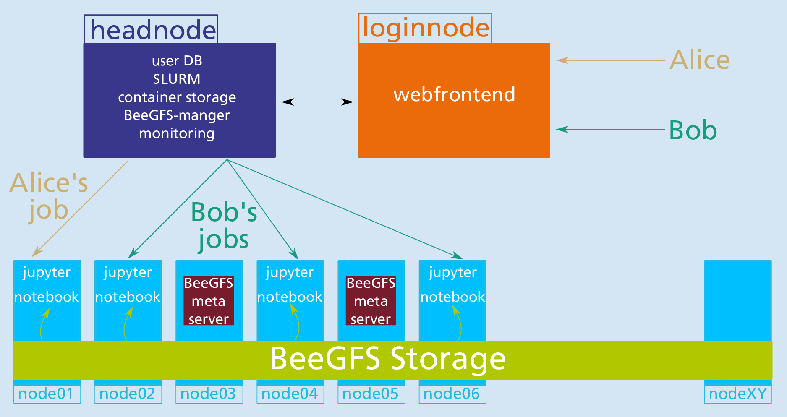

## **HPC meets interactive Data Science and Machine Learning**
**Carme (/ˈkɑːrmiː/ KAR-mee; Greek: Κάρμη) is a Jupiter moon, also giving the name for a Cluster of Jupiter moons (the carme group).**

_or in our case..._

an open source framework to manage resources for **multiple users** running **interactive jobs** on a **Cluster** of (GPU) compute nodes.

## **Follow us on Twitter**
&rarr; [#OpenCarme](https://twitter.com/open_carme)

## **Presentations**
_(selection)_
* [Slides from our talk at ISC18 06/2018](https://www.researchgate.net/publication/325967129_Carme-An_Open_Source_Framework_for_Multi-User_Interactive_Machine_Learning_on_Distributed_GPU-Systems)
* [Slides from our talk at LRZ 10/2018](https://www.researchgate.net/publication/328161743_Carme-An_Open_Source_Framework_for_Multi-User_Interactive_Machine_Learning_on_Distributed_GPU-Systems)
* [Slides from ISC 06/2019](https://www.researchgate.net/publication/334319039_Carme_-An_Open_Source_Framework_for_Multi-User_Interactive_Machine_Learning_on_Distributed_GPU-Systems)

## **Core Idea**
_We combine established open source ML and DS tools with HPC backends and use therefore_
* [Singularity containers](https://sylabs.io)
* [Anaconda environments](https://www.anaconda.com/distribution)
* web based GUI frontends e.g. [Theia-IDE](https://theia-ide.org) and [JupyterLab](https://github.com/jupyterlab/jupyterlab)
* completely web frontend based  
  (OS independent, no installation on user side needed)
* HPC job management and schedulers ([SLURM](https://slurm.schedmd.com))
* HPC data I/O technologies like [Fraunhofer’s BeeGFS](https://www.beegfs.io)
* HPC maintenance and monitoring tools

_Job submission scheme_

## **Key Features**
* **Open source**
  * we use only opensource components that allow commercial usage
  * *Carme* is open source, allowing commercial usage
* **Seamless integration with available HPC tools**
  * Job scheduling via **SLURM**
  * Native **LDAP** support for user authentication
  * Integrate existing distributed file systems like **BeeGFS**
* **Access via web-interface**
  * **OS independent** (only web browser needed)
  * Full user **information** (running jobs, cluster usage, news /  messages)
  * **Start/Stop jobs** within the web-interface
* **Interactive jobs**
  * **Flexible access to GPUs**
  * Access via **web driven GUIs** like Theia-IDE or JupyterLab
  * Job specific **monitoring information** in the web-interface  
    (GPU/CPU utilization, memory usage, access to TensorBoard)
* **Distributed multi-node and/or multi-gpu jobs**
  * **Easy** and **intuitive** job scheduling
  * Directly use **GPI**, **GPI-Space**, **MPI**, **HP-DLF** and **Horovod** within the jobs
* **Full control about accounting and resource management**
  * Job scheduling according to **user specific roles**
  * **Compute resources** are **user exclusive**
* **User maintained, containerized environments**
  * **Singularity containers**  
    (runs as normal user, GPU, Ethernet and Infiband support)
  * **Anaconda Environments**  
    (easy updates, project / user specific environments)
  * **Built-in matching between GPU driver and ML/DL tools**

## **Roadmap**
* [x] since 04/2018: _Carme prototype_ is up and running on our Cluster 
* [x] 03/2019: r0.3.0 (first public release)
* [x] 07/2019: r0.4.0
* [x] 11/2019: r0.5.0
* [x] 12/2019: r0.6.0
* [x] 07/2020: r0.7.0
* [x] 11/2020: **r0.8.0** (latest)
* [ ] 02/2021: *r0.9.0* (development)

## **Documentation**
Visit our documentation at [doc.open-carme.org](http://doc.open-carme.org).

## **Who is behind Carme?**
_Carme_ is developed at the [machine learning group](http://itwm.fraunhofer.de/ml) of the [Competence Center for High Performance Computing](https://www.itwm.fraunhofer.de/en/departments/hpc.html) at [Fraunhofer ITWM](https://www.itwm.fraunhofer.de).

_NOTE:_ We are open for contributions!

## **Contact**
&rarr; info@open-carme.org

## **Sponsors**
**The development of *Carme* is financed by research grants from**

  

