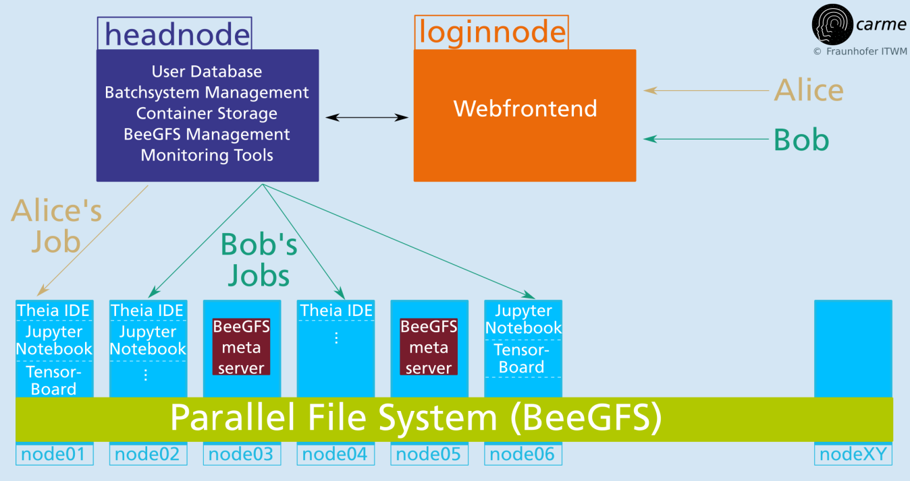

## **HPC meets interactive Data Science and Machine Learning**

**Carme (/ˈkɑːrmiː/ KAR-mee; Greek: Κάρμη) is a Jupiter moon, also giving the name for a Cluster of Jupiter moons (the carme group).**

_or in our case..._

an open source framework to manage resources for **multiple users** running **interactive jobs** on a **Cluster** of (GPU) compute nodes.

This documentation is divided in the following sections:

#### Introduction

- [Carme Presentation](#carme-presentation)
- [Core Idea](#core-idea)
- [Key features](#key-features)

#### Documentation

- [How to install Carme](#how-to-install-carme)
- [How to use Carme](#how-to-use-carme)
- [Roadmap](#roadmap)
- [Releases](#releases)

#### Team
- [Authors](#authors)
- [Contact](#contact)
- [Sponsors](#sponsors)

## Carme Presentation

Refer to our marketing slides: 

- [CARME slides (06/2024)](Slides/[2024-06]--carme--pr-slides.pdf)

## Core Idea

_We combine established open source ML and DS tools with HPC backends and use therefore_

* [Singularity containers](https://sylabs.io)
* [Anaconda environments](https://www.anaconda.com/distribution)
* web–based GUI frontends e.g. [Code-Server](https://github.com/coder/code-server) and [JupyterLab](https://github.com/jupyterlab/jupyterlab)
* completely web frontend based  
  (OS independent, no installation on user side needed)
* HPC job management and schedulers ([SLURM](https://slurm.schedmd.com))
* HPC data I/O technologies like [Fraunhofer’s BeeGFS](https://www.beegfs.io)
* HPC maintenance and monitoring tools

_Job submission scheme_

## **Key Features**

* **Open source**
  * we use only open source components that allow commercial usage
  * Carme is open source, allowing commercial usage
* **Seamless integration with available HPC tools**
  * Job scheduling via **SLURM**
  * Native **LDAP** support for user authentication
  * Integrate existing distributed file systems like **BeeGFS**
* **Access via web-interface**
  * **OS independent** (only web browser needed)
  * requires **2FA**
  * Full user **information** (running jobs, cluster usage, news /  messages)
  * **Start/Stop jobs** within the web-interface
* **Interactive jobs**
  * **Flexible access to accelerators**
  * Access via **web driven GUIs** like code server or JupyterLab
  * Job specific **monitoring information** in the web-interface  
    (GPU/FPGA/CPU utilization, memory usage, access to TensorBoard)
* **Distributed multi-node and/or multi-gpu jobs**
  * **Easy** and **intuitive** job scheduling
  * Directly use **GPI**, **GPI-Space**, **MPI**, **HP-DLF** and **Horovod** within the jobs
* **Full control about accounting and resource management**
  * Job scheduling according to **user/project specific roles**
  * **Compute resources** are **user/project exclusive**
* **User maintained, containerized environments**
  * **Singularity containers**  
    (runs as normal user, GPU, Ethernet and Infiniband support)
  * **Anaconda Environments**  
    (easy updates, project / user specific environments)
  * **Built-in matching between GPU driver and ML/DL tools**

## How to install Carme

Refer to our [installation documentation](https://docs.open-carme.org/InstallDoc).

## How to use Carme

Refer to our [documentation](https://docs.open-carme.org).

## **Roadmap**

#### Current release:
* **06/2024**
  * Carme-demo 0.9.9: Installation script to test Carme in single-devices and clusters. Refer to our [installation documentation](https://docs.open-carme.org/InstallDoc).
  * Carme r0.9.9: Automatically syncs slurm.conf with Carme database.
  * Documentation is extended.

#### Next release: 
* **10/2024**
  * Carme-demo 1.0: 
    * Adapted to GPU clusters with pre-set SLURM.
    * Adapted to RedHat (currently is Debian-based).
    * Adapted to multi-users (currently is single-user).
  * Carme r1.0:
    * Carme runs in AWS (Amazon Web Services).
    
## Releases

* 04/2018: Carme prototype at ITWM

* 03/2019: r0.3.0 (first public release)

* 07/2019: r0.4.0

* 11/2019: r0.5.0

* 12/2019: r0.6.0

* 07/2020: r0.7.0

* 11/2020: r0.8.0

* 08/2021: r0.9.0

* 05/2022: r0.9.5

* 09/2022: r0.9.6

* 08/2023: r0.9.7

* 12/2023: r0.9.8

* 06/2024: **r0.9.9 (latest)**

## Authors

Carme is developed by the [Competence Center for High Performance Computing](https://www.itwm.fraunhofer.de/en/departments/hpc.html) at [Fraunhofer ITWM](https://www.itwm.fraunhofer.de).

## Contact

&rarr; [christian.ortiz@itwm.fraunhofer.de](christian.ortiz@itwm.fraunhofer.de)

## Sponsors

**The development of Carme is financed by research grants from**

  

